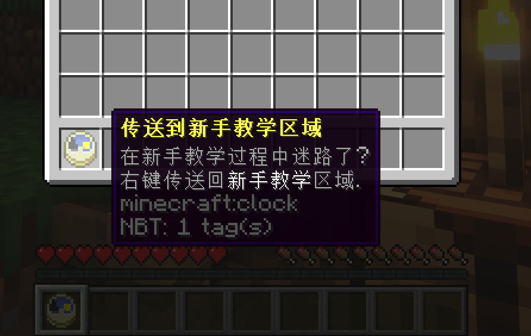

# Skript-NewbieClock
 [ [

## 机制
本 Skript 已达到定制者的以下要求： 
> 我服务器是1.16.3paper。 
服里有新手教学,指引玩家走完一段路, 
玩家完成教学前属于New降级权限组，完成后到Default组 
(用的是luckperms, Groupmanager也可以) 
考虑到新手可能在教学里无聊想出去逛逛，就没有把新手教学的四周封死， 
但现在我害怕玩家随后迷路找不到新手教学 
所以我想让所有New权限组的物品栏第一格强制放一个钟，这个钟的作用呢没有别的, 就是右键回到/warp new去 
这个钟，不能被扔掉, 不能被换格子，不能以任何方式离开物品栏第一格, 直到玩家完成新手教学升级到Default组为止 
升级后这个钟消失,或者可以被扔掉。 

 

## 说明
<b>权限：</b>newbieclock.new - “新手”拥有的权限 